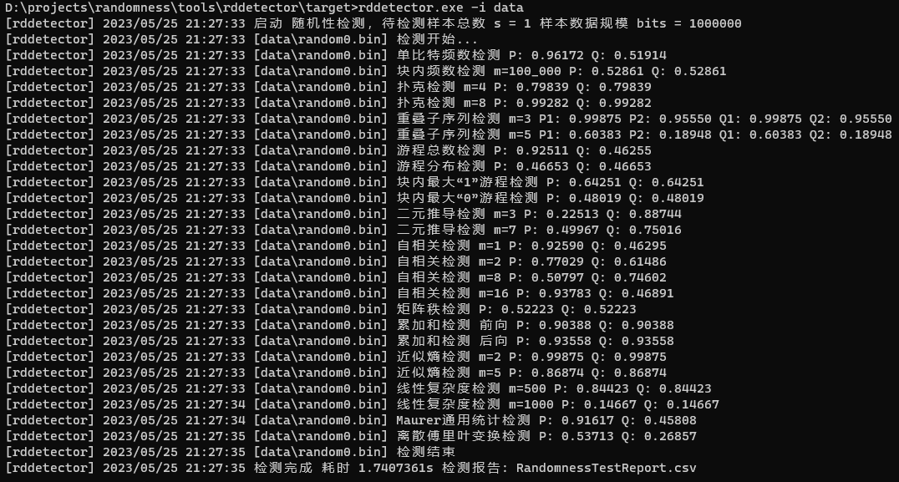

# Randomness 二元序列随机性检测方法

[](https://pkg.go.dev/github.com/Trisia/randomness)  

**在使用randomness前，请务必悉知 [***《randomness 免责声明》***](免责声明.md)！**

> - 致谢 [zhebinhu/randomnessTests](https://github.com/zhebinhu/randomnessTests) 项目。
> - 致谢 [Sun Yimin](https://github.com/emmansun)  对本项目关键性建设。

## 项目概述

该工具库实现了《GM/T 0005-2021 随机性检测规范》中描述的15种随机性检测方法。



- [ 1] 单比特频数检测      [MonoBitFrequencyTest](./mono_bit_frequency.go)
- [ 2] 块内频数检测        [FrequencyWithinBlockTest](./frequency_within_block.go)
- [ 3] 扑克检测           [PokerTest](./poker.go)
- [ 4] 重叠子序列检测      [OverlappingTemplateMatchingTest](./overlapping.go)
- [ 5] 游程总数检测        [RunsTest](./runs.go)
- [ 6] 游程分布检测        [RunsDistributionTest](./runs_distribution.go)
- [ 7] 块内最大游程检测     [LongestRunOfOnesInABlockTest](./longest_run_of_ones_In_block.go)
- [ 8] 二元推导检测       [BinaryDerivativeTest](./binary_derivative.go)
- [ 9] 自相关检测         [AutocorrelationTest](./autocorrelation.go)
- [10] 矩阵秩检测        [MatrixRankTest](./matrix_rank.go)
- [11] 累加和检测        [CumulativeTest](./cumulative.go)
- [12] 近似熵检测        [ApproximateEntropyTest](./approximate_entropy.go)
- [13] 线型复杂度检测     [LinearComplexityTest](./linear_complexity.go)
- [14] Maurer通用统计检测       [MaurerUniversalTest](./maurers_universal.go)
- [15] 离散傅里叶检测     [DiscreteFourierTransformTest](./discrete_fourier_transform.go)


### 检测工具

若您需要使用相关测试工具需要可以 **[从Release中下载编译版本](https://github.com/Trisia/randomness/releases)** 或 **手动编译程序**，详见文档：

- [随机性检测工具 使用说明 rddetector](./tools/rddetector/README.md)
- [数据生成工具 使用说明 rdgen](./tools/rdgen/README.md)


## 快速入门 

`rddetector`检测工具只是`randomness`的一种应用方式，`randomness`提供丰富的API接口，您可以在根据需要定制化的使用。

安装`randomness`：

```bash
go get -u github.com/Trisia/randomness
```

下面是10^6比特数据规模的扑克检测的例子：

```go
package main

import (
	"crypto/rand"
	"fmt"
	"github.com/Trisia/randomness"
)

func main() {
	// 产生随机数序列
	n := 1000_000
	buf := make([]byte, n/8)
	_, _ = rand.Read(buf)
	// 转换为字节数组
	bits := randomness.B2bitArr(buf)

	// 运行测试组
	p, _ := randomness.PokerTest(bits)
	fmt.Printf("扑克检测 n: 1000000, P-value: %f\n", p)
}
```

更多API使用方法见：[randomness API 文档](https://pkg.go.dev/github.com/Trisia/randomness)

## 随机数发生器检测

`randomness`
实现了 [《GM/T 0025-2014 SSL VPN 网关产品规范》](http://www.gmbz.org.cn/main/viewfile/20180110021527664415.html) 5.4.4.3
随机数发生器 4个不同应用阶段的随机数检测：

- 出厂检测 [detect.FactoryDetect](detect/detect.go)
- 上电检测 [detect.PowerOnDetect](detect/detect.go)
- 周期检测 [detect.PeriodDetect](detect/detect.go)
- 单次检测 [detect.SingleDetect](detect/detect.go)

使用方法见 [测试用例 detect_test.go](detect/detect_test.go)

如果您的主机处理器含有多个核心，那么可以使用Fast系列的API来加速检测，见 [测试用例 detect_fast_test.go](detect/detect_fast_test.go)

> 注意：离散傅里叶检测 10^8 bit 规模数据检测为了加速计算单次检测需要消耗1024MB以上内存，请注意主机并发数量防止发生内存溢出（OOM）。


## 发展

检测规范：

- 《GM/T 0005-2012 随机性检测规范》 *已废止*
- 《GB/T 32915-2016 信息安全技术 二元序列随机性检测方法》
- [《GM/T 0005-2021 随机性检测规范》](http://www.gmbz.org.cn/main/viewfile/20220805030323734119.html)

在 GM/T 0005-2021 中在 **样本通过率判定** 的基础上，增加了 **样本均匀性判定** 作为检测通过判定依据，详见 GM/T 0005-2021
6.3。

目前 **randomness** 已经升级至《GM/T 0005-2021 随机性检测规范》。

