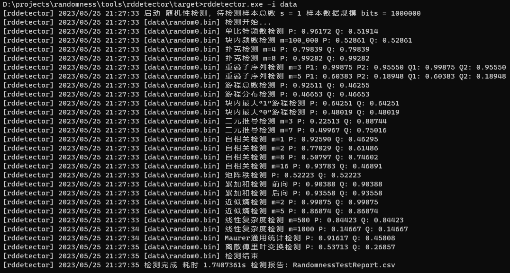

# Randomness 二元序列随机性检测方法

[](https://pkg.go.dev/github.com/Trisia/randomness)  

**在使用randomness前，请务必悉知 [*《randomness 免责声明》*](免责声明.md)！**

> - 致谢 [zhebinhu/randomnessTests](https://github.com/zhebinhu/randomnessTests) 项目。
> - 致谢 [Sun Yimin](https://github.com/emmansun) 对本项目关键性建设。

## 项目概述

该工具库实现了《GM/T 0005-2021 随机性检测规范》中描述的15种随机性检测方法。



- [ 1] 单比特频数检测      [MonoBitFrequencyTest](./mono_bit_frequency.go)
- [ 2] 块内频数检测        [FrequencyWithinBlockTest](./frequency_within_block.go)
- [ 3] 扑克检测            [PokerTest](./poker.go)
- [ 4] 重叠子序列检测      [OverlappingTemplateMatchingTest](./overlapping.go)
- [ 5] 游程总数检测        [RunsTest](./runs.go)
- [ 6] 游程分布检测        [RunsDistributionTest](./runs_distribution.go)
- [ 7] 块内最大游程检测    [LongestRunOfOnesInABlockTest](./longest_run_of_ones_In_block.go)
- [ 8] 二元推导检测        [BinaryDerivativeTest](./binary_derivative.go)
- [ 9] 自相关检测          [AutocorrelationTest](./autocorrelation.go)
- [10] 矩阵秩检测          [MatrixRankTest](./matrix_rank.go)
- [11] 累加和检测          [CumulativeTest](./cumulative.go)
- [12] 近似熵检测          [ApproximateEntropyTest](./approximate_entropy.go)
- [13] 线型复杂度检测      [LinearComplexityTest](./linear_complexity.go)
- [14] Maurer通用统计检测  [MaurerUniversalTest](./maurers_universal.go)
- [15] 离散傅里叶检测      [DiscreteFourierTransformTest](./discrete_fourier_transform.go)

### 检测工具

若您需要使用相关测试工具，可以 **[从 Release 中下载编译版本](https://github.com/Trisia/randomness/releases)** 或 **手动编译程序**，详见文档：

- [随机性检测工具 使用说明 rddetector](./tools/rddetector/README.md)
- [数据生成工具 使用说明 rdgen](./tools/rdgen/README.md)

## 快速入门

`rddetector` 检测工具只是 `randomness` 的一种应用方式，`randomness` 提供丰富的 API 接口，您可以根据需要定制化使用。

安装 `randomness`：

```bash
go get -u github.com/Trisia/randomness
```

下面是 $10^6$ 比特数据规模的扑克检测的例子：

```go
package main

import (
	"crypto/rand"
	"fmt"
	"github.com/Trisia/randomness"
)

func main() {
	// 产生随机数序列
	n := 1000000
	buf := make([]byte, n/8)
	_, _ = rand.Read(buf)

	// 直接对字节做检测，内部会自动完成转换
	p, _ := randomness.PokerTestBytes(buf, 8)
	fmt.Printf("扑克检测 n: 1000000, P-value: %f\n", p)
}
```

### 数据检测建议

推荐使用 `BitSeq` 后缀的接口来实现同一组数据的多次检测，可以有效的减少数据转换和内存占用。（例如：`RunsTestBytes` 对应 `RunsTestBitSeq`）

```go
package main

import (
	"crypto/rand"
	"fmt"
	"github.com/Trisia/randomness"
)

func main() {
	n := 1000000
	buf := make([]byte, n/8)
	_, _ = rand.Read(buf)

	// 使用构造器把字节打包成 BitSeq（10^6 bit 约 0.07ms / 131KB）
	s := randomness.NewBitSeqFromBytes(buf)

	// 后续所有检测复用同一个 BitSeq，不再产生任何转换开销
	p, q := randomness.FrequencyWithinBlockTestBitSeq(s, 10000)
	fmt.Printf("块内频数检测 P: %f Q: %f\n", p, q)

	p, q = randomness.RunsTestBitSeq(s)
	fmt.Printf("游程总数检测 P: %f Q: %f\n", p, q)

	p1, p2, _, _ := randomness.OverlappingTemplateMatchingTestBitSeq(s, 5)
	fmt.Printf("重叠子序列检测 P1: %f P2: %f\n", p1, p2)

	// 或者直接遍历与 TestMethodArr 一一对应的 TestMethodSeqArr
	for _, item := range randomness.TestMethodSeqArr {
		res := item.Runner(s)
		fmt.Printf("%s P: %f Q: %f 通过: %v\n", res.Name, res.P, res.Q, res.Pass)
	}
}
```


`BitSeq`提供了多种方法，您可以实现多种数据类型自由转换和数据的随机访问。

更多 API 使用方法见：[randomness API 文档](https://pkg.go.dev/github.com/Trisia/randomness)

## 随机数发生器检测

`randomness`
实现了 [GM/T 0062-2018《密码产品随机数检测要求》](http://www.gmbz.org.cn/main/viewfile/20180519123243999421.html) 9. E类产品随机数检测
随机数发生器 4个不同应用阶段的随机数检测：

- 出厂检测 [detect.FactoryDetect](detect/detect.go)
- 上电检测 [detect.PowerOnDetect](detect/detect.go)
- 周期检测 [detect.PeriodDetect](detect/detect.go)
- 单次检测 [detect.SingleDetect](detect/detect.go)

使用方法见 [测试用例 detect_test.go](detect/detect_test.go)

如果您的主机处理器含有多个核心，那么可以使用 Fast 系列的 API 来加速检测，见 [测试用例 detect_fast_test.go](detect/detect_fast_test.go)

## 发展

检测规范：
- [GM/T 0005-2021《随机性检测规范》](http://www.gmbz.org.cn/main/viewfile/20220805030323734119.html)
- GB/T 32915-2016《信息安全技术 二元序列随机性检测方法》
- GM/T 0005-2012《随机性检测规范》 *已废止*

在 GM/T 0005-2021《随机性检测规范》中在 **样本通过率判定** 的基础上，增加了 **样本均匀性判定** 作为检测通过判定依据，详见 GM/T 0005-2021
《随机性检测规范》 6.3。

目前 **randomness** 已经升级至 GM/T 0005-2021《随机性检测规范》。