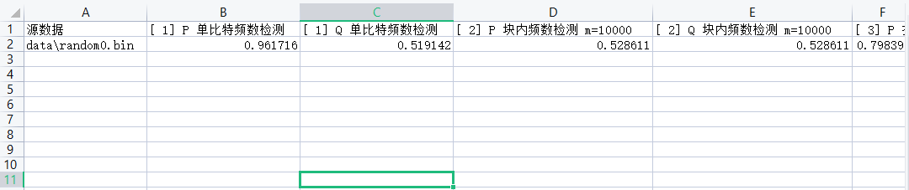

# 随机性检测工具 rddetector 使用说明

## 概述

随机数随机性检测检测方法依据《GM/T 0005-2021 随机性检测规范》中提及的15种检测方法，检测完成后，将会生成`csv`格式检测报告。

待检测数据规模将由程序根据文件大小自动推断，支持单文件（后缀为`.bin`）规模:

- 20 000 bit
- 1 000 000 bit
- 100 000 000 bit

## 使用手册


工具使用说明：

```
randomness 随机性检测 rddetector 使用说明

rddetector -i 待检测数据目录 [-o 生成报告位置] [-a 分析报告位置] [-f 输出格式] [-t 通过阈值]

        示例: rddetector -i /data/target/ -o RandomnessTestReport.csv -a AnalysisReport.csv -f csv -t 0.981
        示例: rddetector -i /data/target/ -o RandomnessTestReport.json -a AnalysisReport.json -f json

  -a string
        生成的分析报告位置（可选）
  -f string
        输出格式 (csv/json/xml) (default "csv")
  -i string
        待检测随机数文件位置
  -n int
        工作线程数 (default CPU核心数)
  -o string
        生成的检测报告位置 (default "RandomnessTestReport.csv")
  -t float
        通过判定阈值（默认98.1%） (default 0.981)
  -v    检测工具版本
```

**注意：在离散傅里叶检测 10^8 bit 规模数据检测为了加速计算 单次检测 需要消耗 1024MB以上 内存，请控制 `n` 数量防止发生内存溢出（OOM）！**


运行效果如下：


检测报告CSV文件如下所示：



CSV具有简单的数据结构，各项之间使用`,`（英文逗号）分割，您可以通过程序通过简单的处理提取或分析，也可以使用WPS、Excel等工具打开进行分析。

### 分析报告功能

rddetector 新增了分析报告功能，可以根据 P、Q 值对每组检测进行通过判定，生成统计报告。

### 分析报告格式

分析报告包含以下列：
- **检测项目（含参数）**: 具体的检测项目名称和参数
- **通过数**: 通过该检测项目的文件数量
- **检测数**: 总检测文件数量
- **通过率**: 通过数/检测数的比值
- **满足随机性要求**: 设定的通过阈值（默认98.1%）
- **是否通过**: 根据通过率是否达到阈值判断

### 通过判定规则

1. **单个文件通过判定**: 根据 GM/T 0005-2021 规范，单个文件通过检测需同时满足：
   - P值 >= 0.01
   - Q值 >= 0.0001

2. **整体通过判定**: 以检测文件数和该项检测通过文件数的比值作为通过判定依据
   - 通过率 = 通过文件数 / 总检测文件数
   - 满足随机性要求的通过值为 98.1%（可通过 `-t` 参数调整）

### 输出格式

支持多种输出格式，通过统一的格式化接口实现：
- **CSV格式** (默认): 适合使用 Excel、WPS 等工具查看和分析
- **JSON格式**: 适合程序化处理和自动化分析
- **XML格式**: 适合需要结构化数据交换的场景

### 可扩展的格式化架构

rddetector 采用了可扩展的格式化架构，便于未来支持更多输出格式：

```go
// ReportFormatter 报告格式化接口
type ReportFormatter interface {
    FormatTestReport(results []*R, w io.Writer) error
    FormatAnalysisReport(results []AnalysisResult, w io.Writer) error
}
```

要添加新的输出格式，只需实现 `ReportFormatter` 接口即可。

### 使用示例

```bash
# 生成CSV格式分析报告
rddetector -i /data/target/ -o RandomnessTestReport.csv -a AnalysisReport.csv -f csv -t 0.981

# 生成JSON格式分析报告
rddetector -i /data/target/ -o RandomnessTestReport.csv -a AnalysisReport.json -f json
```

## 编译

切换到`tools/rddetector`目录内运行，本项目并无三方依赖，直接运行编译命令即可：

```
go build .
```

## 检测规格

rddetector 检测工具只进行检测，不对结果进行判断，判断逻辑请参考《GM/T 0005-2021 随机性检测规范》 6 随机性检测判定。

检测参数：

- 显著水平(**P**)：`α = 0.01`
- 样本均匀性分布检测的显著性水平（**Q**）： `ατ = 0.0001`
- 子区间数量： `k = 10`

样本通过检测应同时满足以下条件：

- 显著水平：`P >= α` （`α = 0.01`）
- 样本均匀性分布检测的显著性水平：`Q >= ατ` （`ατ = 0.0001`）


《GM/T 0005-2021 随机性检测规范》附录 A 样本长度及检测设置中提及的检测规格如下。

### 20 000 比特检测规格

长度为`20 000`比特的样本按下表的随机性检测方法和检测参数进行随机性统计检测。

| 序号 | 检测项目              | 参数         |
|----|-------------------|------------|
| 1  | 单比特频数检测           | -          |
| 2  | 块内频数检测            | m = 1 000  |
| 3  | 扑克检测              | m = 4,8    |
| 4  | 重叠子序列检测           | m = 3,5    |
| 5  | 游程总数检测            | -          |
| 6  | 游程分布检测            | -          |
| 7  | 块内最大游程检测(“1”、“0”) | m = 128    |
| 8  | 二元推导检测            | k = 3,7    |
| 9  | 自相关检测             | d = 2,8,16 |
| 10 | 累加和检测（前向、后向）      | -          |
| 11 | 近似熵检测             | m = 2,5    |
| 12 | 离散傅里叶检测           | -          |

### 1 000 000 比特检测规格

长度为`1 000 000`比特的样本按下表的随机性检测方法和检测参数进行随机性统计检测。

| 序号 | 检测项目              | 参数            |
|----|-------------------|---------------|
| 1  | 单比特频数检测           | -             |
| 2  | 块内频数检测            | m = 10 000    |
| 3  | 扑克检测              | m = 4,8       |
| 4  | 重叠子序列检测           | m = 3,5       |
| 5  | 游程总数检测            | -             |
| 6  | 游程分布检测            | -             |
| 7  | 块内最大游程检测（“1”、“0”） | m = 10 000    |
| 8  | 二元推导检测            | k = 3,7       |
| 9  | 自相关检测             | d = 1,2,8,16  |
| 10 | 矩阵秩检测             | -             |
| 11 | 累加和检测（前向、后向）      | -             |
| 12 | 近似熵检测             | m = 2,5       |
| 13 | 线型复杂度检测           | m = 500,1 000 |
| 14 | Maurer通用统计检测      | L=7,Q=1 280   |
| 15 | 离散傅里叶检测           | -             |

### 100 000 000 比特检测规格

长度为`100 000 000`比特的样本按下表的随机性检测方法和检测参数进行随机性统计检测。

| 序号 | 检测项目              | 参数              |
|----|-------------------|-----------------|
| 1  | 单比特频数检测           | -               |
| 2  | 块内频数检测            | m = 1000 000    |
| 3  | 扑克检测              | m = 4,8         |
| 4  | 重叠子序列检测           | m = 3,5         |
| 5  | 游程总数检测            | -               |
| 6  | 游程分布检测            | -               |
| 7  | 块内最大游程检测（“1”、“0”） | m = 10 000      |
| 8  | 二元推导检测            | k = 3,7,15      |
| 9  | 自相关检测             | d = 1,2,8,16,32 |
| 10 | 矩阵秩检测             | -               |
| 11 | 累加和检测（前向、后向）      | -               |
| 12 | 近似熵检测             | m = 5,7         |
| 13 | 线型复杂度检测           | m = 5 000       |
| 14 | Maurer通用统计检测      | L=7,Q=1 280     |
| 15 | 离散傅里叶检测           | -               |

